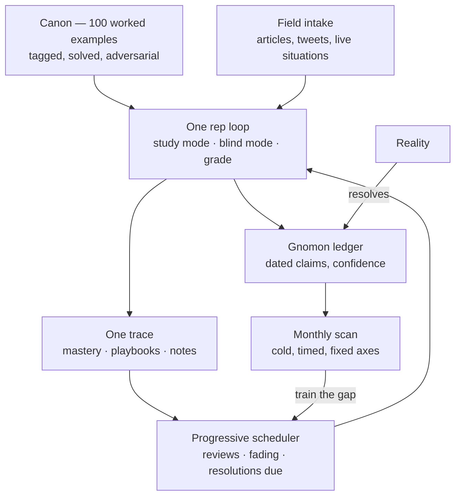

# Parabolic 100

**A deployment-judgment gym.** One hundred worked examples of the judgment that AI deployment roles actually test — trained the way NeetCode trains algorithms, calibrated against reality instead of an answer key.

Role tags throughout — enterprise seats and frontier labs alike, Microsoft MAI included — are lenses showing where each judgment pattern transfers: a taxonomy of the industry, not a job-search list.

Everything runs in your browser. No accounts, no backend, no API keys. Your reps, notes, and calibration record live in localStorage and export to a single JSON file.

---

## Why this exists

LeetCode's real lesson was never the 2,000 problems — it was the method: **worked examples, organized by reusable pattern, drilled on a schedule, with forced commitment before seeing the answer.** That method made algorithmic interview skill trainable for anyone willing to grind.

The judgment tested by AI deployment roles — forward-deployed engineering, technical program management at model labs, enterprise AI architecture and adoption — has no equivalent gym. It's acquired accidentally, over years, by being in the room when things go wrong. Yet it decomposes the same way algorithms do: a bounded set of situations (a customer demands a roadmap commitment; a pilot succeeds and then stalls; an eval dashboard stays green while users flee) resolved by a bounded set of moves.

Parabolic 100 makes that decomposition explicit and trains it deliberately:

1. **Worked examples first.** Each canonical problem carries a complete worked solution — not just an answer, but the diagnosis, the move, the measurement, the falsifier, and a critique of the tempting wrong answers. Study them like annotated master games.
2. **Patterns as the unit of skill.** Every problem drills 1–3 of 18 named judgment moves. You learn *Gate Design* once and recognize it in a model launch, an ERP write-access request, and a safety-eval fight.
3. **Commitment before revelation.** Blind mode locks your written answer before showing the model's. Vagueness has nowhere to hide.
4. **Calibration on the wild.** The canon trains you; fresh material — articles, tweets, live situations you paste in — tests you. Skill that only appears on known problems isn't skill yet.
5. **Reality as the grader of last resort.** Claims with dates go into a ledger. When the date arrives, reality scores them. Only resolved claims feed your calibration record.

The premise underneath all of it: you can offload tasks, but you can never offload your learning. This is a machine for compounding the part that can't be offloaded.

---

## What a rep looks like

Ten minutes, five phases:

| Phase | What happens | Time |
|---|---|---|
| **Open** | One action — the scheduler already knows what's next (due reviews → resolutions due → new material) | seconds |
| **Read** | The scenario, its arc (start → midpoint → endpoint), and nothing else | ~90 sec |
| **Commit** | Classify (category, pattern, lenses, archetype), then write the call: bottleneck, failure mode, next move, first metric, owner, falsifier, a 20-second executive answer, and a role translation. Predict your score. | ~5 min |
| **Grade** | Classification auto-checks against the tags. Your commitments sit side-by-side with the worked solution. Self-grade six rubric dimensions; judge yourself against the model answer. | ~3 min |
| **Compound** | The adversarial critique, altitude rewrites, and the recursive follow-up. Your note lands in every relevant pattern playbook. The rep schedules its own return. | ~90 sec |

Two modes per canonical problem:

- **Study mode** — the worked solution is open from the start. You read it the way you'd read an annotated game, and annotate it yourself. This is where new patterns begin (the worked-example effect: novices learn faster from solutions than from struggle).
- **Blind mode** — commit first, reveal second. This is where patterns get proven.

The scheduler **fades** you from study to blind per pattern: first exposure to a pattern serves a studied example; everything after demands commitment.

---

## Core concepts

### 1. The canon — 100 worked examples

Nine categories mirroring where deployment programs actually live or die: Scenario Discovery, Agent Architecture, Enterprise Integration, Governance & Risk, Evals & Measurement, Deployment & Change Management, Platform Feedback & Product Strategy, Frontier-Lab Transfer, Market & Capital Calibration.

Anatomy of a worked example:

| Part | What it's for |
|---|---|
| `prompt` | A specific, concrete situation — names, numbers, constraints. Never a textbook abstraction. |
| `arc` | Start → midpoint → endpoint: the shape of the situation, like an opening → middlegame → endgame. |
| `expected` | The six commitments a strong operator would write: bottleneck, failure mode, next move, metric, owner, falsifier. |
| `modelAnswer` | The full worked solution — diagnosis, move, measurement, and the reasoning that connects them. |
| `rubric` | Per-problem descriptors for six standardized dimensions: Diagnosis, Next Move, Measurement, Synthesis, Altitude, Transfer. |
| `adversarial` | A critique that attacks the *tempting* answers — the plausible-but-wrong moves that sound right in the room. |
| `altitude` | The same judgment rewritten for three rooms: the executive, the engineering lead, the interviewer. |
| `recursiveFollowup` | The situation, one turn harder. Unlocks as a scheduled rep once the base problem is solved. |

### 2. The pattern taxonomy — 18 moves, 4 tiers

The roadmap layer. Problems are drills; these are the skills.

| Tier | Patterns |
|---|---|
| **T1 — Reads** *(see the situation)* | Bottleneck Reclassification · Solution-Shape Matching · Ask → Need Decomposition · Who Bears the Risk |
| **T2 — Mechanisms** *(build the machine)* | Gate Design · Staged Exposure · Failure Decomposition · Instrument Before Acting · Paved Road |
| **T3 — Hard Calls** *(judgment under pressure)* | Ownership Forcing · Precedent Pricing · Allocation Under Scarcity · Contain-Remediate-Reexpand · Trust Recovery |
| **T4 — Multipliers** *(compound everything)* | Evidence Shaping · Altitude Switching · Prototype for Belief · Portfolio Triage |

Each pattern page carries: the move (one sentence), the tells (when to reach for it), the anti-pattern (how it's fumbled), how interviews probe it, its training problems, and your playbook (below). Pattern recognition is itself trained — naming the pattern is part of every rep's auto-checked classification.

### 3. Field reps — the honest eval

Paste anything: an article, a tweet, a two-line description of something that happened at work today. The same loop runs — classify against the taxonomy, write your commitments — but there is **no answer key**, so grading changes:

- You grade against the *pattern's* rubric: did you execute the move, catch the tells, avoid the named anti-pattern?
- If the material contains a claim about the future, you're prompted to extract it as a **dated, falsifiable prediction** — which enters the Gnomon ledger (below) and gets graded by reality, not by you.

Field reps are the production traffic to the canon's curated set. A fixed bank self-graded forever is a rotting instrument — the app's own problems (*Golden Set Rot*, *The 90% Demo*) describe exactly that failure, so the tool is built not to commit it.

### 4. The Gnomon ledger — calibration against reality

A gnomon is the part of a sundial that casts the shadow: fixed, simple, and honest, because the sun does the measuring. Same idea here — **you make the claim; time grades it.**

Two calibration loops run at different speeds:

- **Fast loop (every rep):** predict your score before the reveal. Calibration = how small your surprise is, tracked as `100 − 2 × avg |predicted − actual|`.
- **Slow loop (the ledger):** any rep can emit a claim — `{ claim, confidence %, falsifier, resolve-by date }`. It sits open until its date surfaces in the review queue. You resolve it against what actually happened: hit / partial / miss / void. **Only resolved claims feed the record.**

What the ledger produces: hit rate by confidence bucket (your calibration curve), Brier score, resolution discipline (what fraction of claims you actually resolve on time — unresolved predictions are how people remember themselves as prophets), and per-pattern calibration — the system will tell you, with receipts, that your market reads run overconfident while your governance reads sandbag.

And it feeds back: resolved misses annotate the relevant pattern's playbook, and the scheduler over-serves patterns where your confidence and your accuracy disagree.

### 5. One trace, compounding playbooks

Every attempt, grade, note, and claim — canon or field — writes to one trace. Notes attach to problems; problems belong to patterns; so every pattern page accumulates a **playbook**: your misses, your reusable framings, your answers to the follow-ups, your resolved mispredictions. The playbook is the institutional memory of you — the artifact that makes rep #80 smarter than rep #8.

### 6. The progressive scheduler

One queue, three kinds of due item:

- **Reviews** — spaced repetition at 1/3/7/14/30 days: strong reps stretch out, weak ones come back tomorrow.
- **Fading** — new patterns start in study mode; the scheduler shifts them to blind.
- **Resolutions** — Gnomon claims whose dates have arrived.

Per pattern, progress climbs a ladder: **untrained → training → proven** (≥85 held across ≥2 problems) **→ field-tested** (applied to wild material) **→ anchored** (predictions under it resolved correctly).

### 7. The monthly scan

Training scores flatter you; tests don't. Once a month, a cold battery — unseen canon problems plus pattern-identification on fresh field items, timed — scored on six fixed axes:

| Axis | Proxy |
|---|---|
| Accuracy | Cold-battery score (not training scores) |
| Calibration | Fast-loop error + slow-loop curve |
| Transfer | First-sight performance on never-seen material |
| Retention | Review scores vs. originals, by interval |
| Speed | Time-to-commit at held accuracy |
| Range | Patterns proven / field-tested, across tiers |

Same axes every month. The gaps point the scheduler at what to train next.

---

## Scoring and mastery

- **Classification (auto, /6):** category, pattern, primary + secondary lens, primary + secondary archetype. Half credit for right-value-wrong-slot; half credit for naming a secondary pattern.
- **Rubric (self-graded, /18):** six dimensions × 0–3, each with per-problem descriptors.
- **Score:** (auto + rubric) / 24, as a percentage. Solved ≥ 70. Problem mastered = two attempts with best ≥ 90.
- **No effort metrics.** There are no streaks, no volume counters, no hour tracking anywhere in the product. The scoreboard is a skill inventory: if the number moved, ability moved.

---

## Architecture



**Files** — vanilla JS, zero dependencies, zero build step:

```
index.html          shell
styles.css          design system (zinc, light, dense tables, no gradients)
app.js              router, state, scoring, scheduler, all views
patterns.js         the 18-pattern taxonomy + problem→pattern tags
problems-*.js       the canon, in content-only files
```

**State** — one localStorage document: attempts (with per-attempt scoring so schema changes never need migrations), review schedule, drafts (a half-finished rep survives anything), notes, field reps, and the Gnomon ledger. Export/import as JSON from the app.

**Principles:** local-first and private by default; no LLM required for the core loop (an optional grading-sparring adapter is on the roadmap, but the product must stay complete without it); worked examples over content, skill over effort, transfer over memorization.

---

## Running it

```bash
# it's a static site — any of these works
open index.html
python3 -m http.server 4173   # then http://localhost:4173
```

Or deploy the repo to GitHub Pages as-is.

---

## Authoring a worked example

The bank grows by pull request against a quality bar (see `docs/AUTHORING.md`):

- The prompt is a *specific situation*, not a topic — someone wants something, something is broken, a decision is due this week.
- The expected falsifier could genuinely flip the call — "measure carefully" is not a falsifier.
- The adversarial critique attacks answers a smart person would actually give, including over-corrected ones.
- The altitude rewrites change framing, never facts.
- Every problem tags 1–3 patterns, and at least one existing pattern — new patterns require three problems that need them.

All scenarios are fictional composites built from public knowledge. No proprietary information, no real customer situations, no employer internals.

---

## Roadmap

- **Bank: 25 → 100** worked examples against the category distribution above
- **Field intake + Gnomon ledger** (the reality-anchored half of the diagram)
- **Study mode + fading scheduler**
- **Monthly scan**
- **Export/import**, then optional LLM sparring adapter (strictly additive)

## License

MIT.
